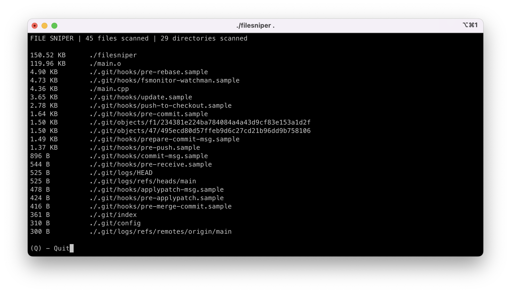

# FileSniper

FileSniper is a fast and simple CLI tool that scans your computer for large files.



## Building
macOS
```bash
brew install ncurses
make
```

## Usage
```bash
filesniper <directory>
```

### Examples

Windows
```bash
.\file_sniper "C:\"
```

macOS
```bash
./file_sniper "/"
```
